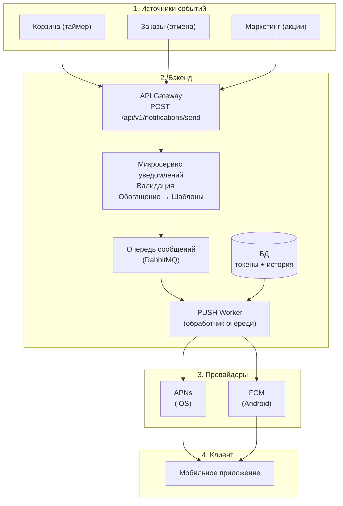

# Архитектура отправки PUSH-уведомлений

```mermaid
flowchart TB
    subgraph Triggers["1. Источники событий"]
        A1["Корзина (таймер)"]
        A2["Заказы (отмена)"]
        A3["Маркетинг (акции)"]
    end

    subgraph Backend["2. Бэкенд"]
        B1["API Gateway<br/>POST /api/v1/notifications/send"]
        B2["Микросервис уведомлений<br/>Валидация → Обогащение → Шаблоны"]
        B3["Очередь сообщений<br/>(RabbitMQ)"]
        B4["PUSH Worker<br/>(обработчик очереди)"]
        B5[("БД<br/>токены + история")]
    end

    subgraph Providers["3. Провайдеры"]
        C1["APNs<br/>(iOS)"]
        C2["FCM<br/>(Android)"]
    end

    subgraph Client["4. Клиент"]
        D1["Мобильное приложение"]
    end

    A1 --> B1
    A2 --> B1
    A3 --> B1
    
    B1 --> B2
    B2 --> B3
    B3 --> B4
    
    B5 --> B4
    
    B4 --> C1
    B4 --> C2
    
    C1 --> D1
    C2 --> D1
```
